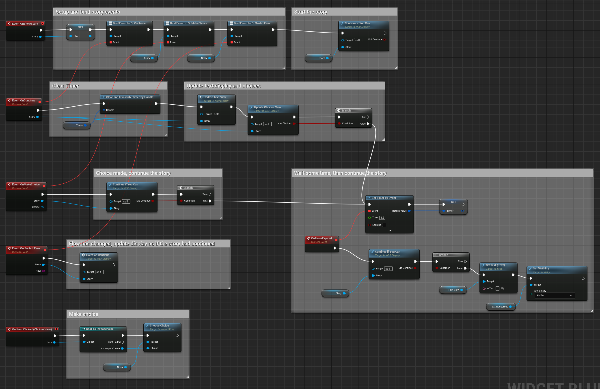
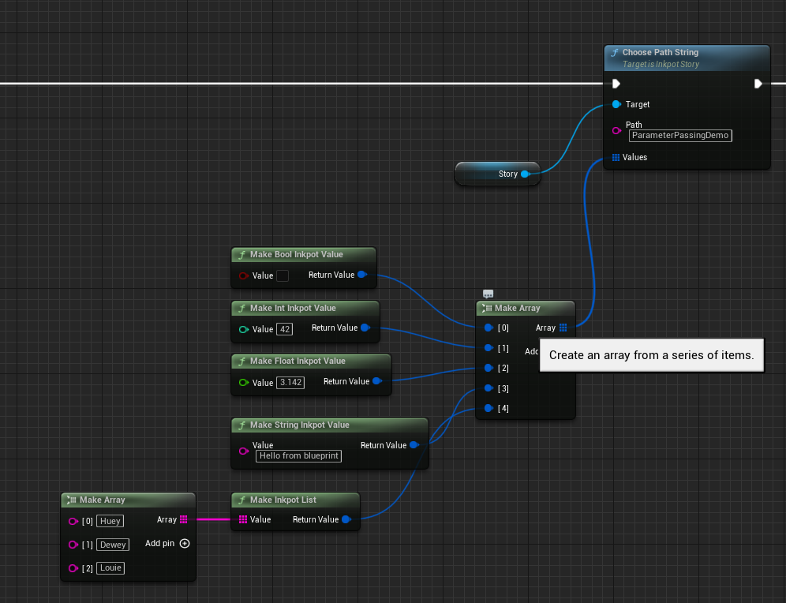
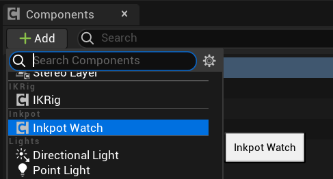
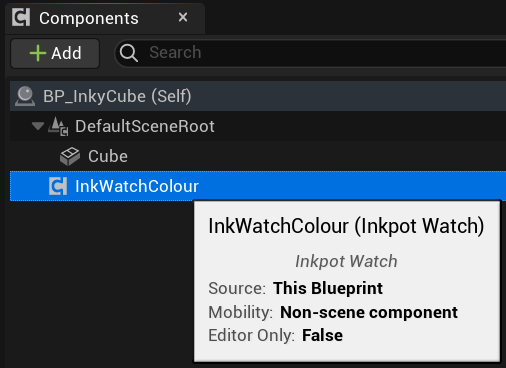
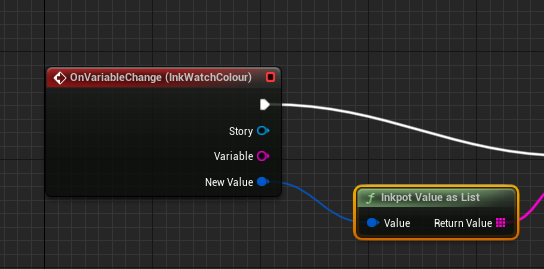
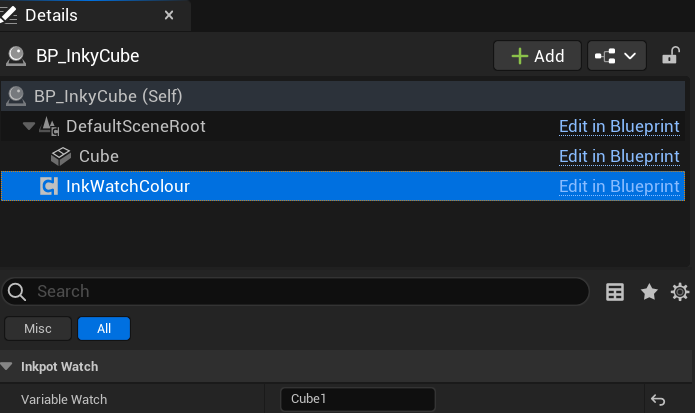

# Inkpot Demo

## Editing Ink source
Use Inky, which you can get from here.
https://github.com/inkle/inky

## Importing ink files 
To import, drag the ink source file into a content browser window within the Unreal Editor. 
The will create the InkpotStoryAsset, that contains the compiled JSON source.

## Setting up auto reimport
Open editor, preferences. 
Look Under general, loading and saving, auto reimpor.

Add a new 'Directories to Monitor' entry by clicking the plus.

Include the source folder, map directory to the corresponding folder in the unreal content browser.

Once this is setup, the content directory will automatically update when you update, create or delete any ink files in the source folder.

## Starting a story 
In blueprints, get the Inkpot subsystem and call BeginStory, passing in the InpotStoryAsset. 

This returns the runtime InkpotStory that executes the script.  
In this demo, the stories are started by the Level Blueprint.

## Getting story updates
Once the story has been started using the BeginStory function of Inkpot, it will return an InkpotStory.
The InkpotStory is the runtime for the Ink script execution.
In this demo, the UI is hooked up to the InkpotStory created by the level blueprint.
This is done in the game mode blueprint, BP_InkpotDemoGameMode.

The UI, where all of the story updates happen, is defined by the widget WBP_Display.

The event graph looks like this. 

Here we see the events that drive Ink execution.

### OnContinue 
This is called once the story has continued. Here we update the UI to show the current stories text, and update the cnoices if there are any. 
This event happens in response to Continue being called on the story.

### OnMakeChoice
A choice has been made. In this demo the user has clicked on a choice shown ( see OnItemClicked ), and the ChooseChoice function has been called. 
Here, we continue the story, which will result in OnContinue being called thereby updating the UI. 

### OnSwitchFlow
Flows allow several 'threads' of story to run at the same time. This is used in the demo level to give contextual story snippets fpr whereever the player has walked to.
This event is called in response to calling the function SwitchFlow on the InkpotStory object.

## Variables
Ink supports type free variables, Blueprints require typed variables. 
To allow conversion between the two there is a blueprint function library to convert from one to the other.

	/* Create an Ink Value from a boolean */
	FInkpotValue MakeBoolInkpotValue(bool bValue);

	/* Cast Ink value to a boolean */
	bool InkpotValueAsBool(FInkpotValue Value);

	/* Create an Ink Value from an integer */
	FInkpotValue MakeIntInkpotValue(int32 Value);

	/* Cast Ink value to an integer*/
	int32 InkpotValueAsInt(FInkpotValue Value);

	/* Create an Ink Value from a float */
	FInkpotValue MakeFloatInkpotValue(float Value);

	/* Cast Ink value to a float*/
	float InkpotValueAsFloat(FInkpotValue Value);

	/* Create an Ink Value from a string */
	FInkpotValue MakeStringInkpotValue(const FString &Value);

	/* Cast Ink value to a string*/
	FString InkpotValueAsString(FInkpotValue Value);

	/* Create an Ink List from an array of Strings */
	FInkpotValue MakeInkpotList(const TArray<FString> &Value);

	/* Get an array of strings from an Ink List */
	TArray<FString> InkpotValueAsList(FInkpotValue Value);    

Alternatively, values can be set directly through the InkpotStory object using one of the Set or Get functions.

	void SetBool(const FString &Variable, bool bValue);
	bool GetBool(const FString &Variable);

	void SetInt(const FString &Variable, int32 Value);
	int32 GetInt(const FString &Variable);

	void SetFloat( const FString& Variable, float Value );
	float GetFloat( const FString& Variable );

	void SetString( const FString& Variable, const FString& Value );
	FString GetString( const FString& Variable );

	void SetEmpty( const FString& Variable );

### Change notification
#### Story Change Delegate
Variable change notification can be achieved through binding to the set on variable change delegate of the story.

#### InkPotWatch component
The InkPotWatch component allows Actors to receive the notification of variable change.
Open up the Actor blueprint and Click Add component, choose InkpotWatch.

Rename it to represent its purpose

Then hook up the event, 

And when this blueprint is placed in the world, set the 'Variable Watch' field to the name of the ink variable to be watched.

