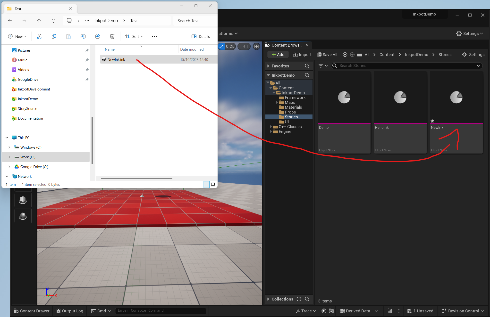
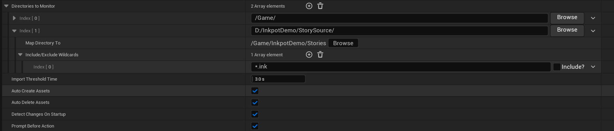
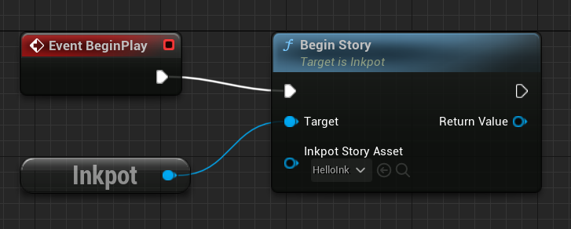
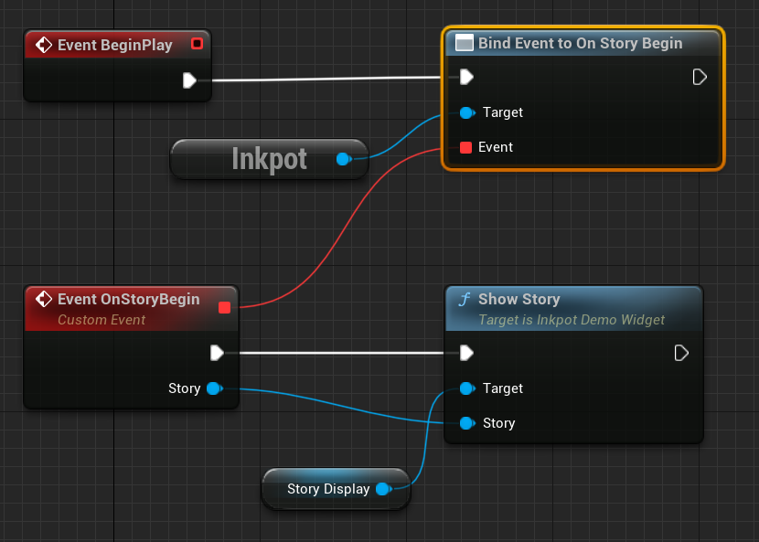

# Inkpot Demo

## Editing Ink source
Use Inky, which you can get from here.
https://github.com/inkle/inky

## Importing ink files 
To import, drag the ink source file into a content browser window within the Unreal Editor. 
The will create the InkpotStoryAsset, that contains the compiled JSON source.

## Setting up auto reimport
Open editor, preferences. 
Look Under general, loading and saving, auto reimpor.

Add a new 'Directories to Monitor' entry by clicking the plus.

Include the source folder, map directory to the corresponding folder in the unreal content browser.

Once this is setup, the content directory will automatically update when you update, create or delete any ink files in the source folder.

## Starting a story 
In blueprints, get the Inkpot subsystem and call BeginStory, passing in the InpotStoryAsset. 

This returns the runtime InkpotStory that executes the script.  
In this demo, the stories are started by the Level Blueprint.

## Getting story updates
Once the story has been satrted using the BeginStory function of Inkpot, it will return an InkpotStory.
The InkpotStory is the runtime for the Ink script execution.
In this demo, the UI is hooked up to the InkpotStory created by the level blueprint.
This is done in the game mode blueprint, BP_InkpotDemoGameMode.

The UI, where all of the story updates happen, is in WBP_Display

### Continue 
### Choices 
### Selection 

## Variables
### Setting a variable
### Getting a variable
### Change notification

## Flow control

