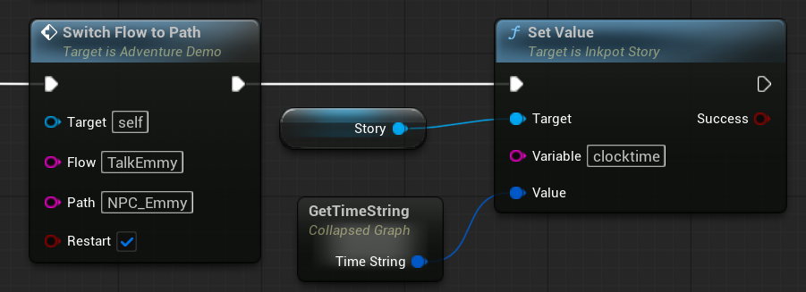
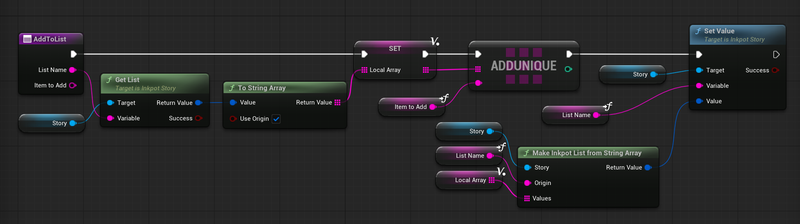
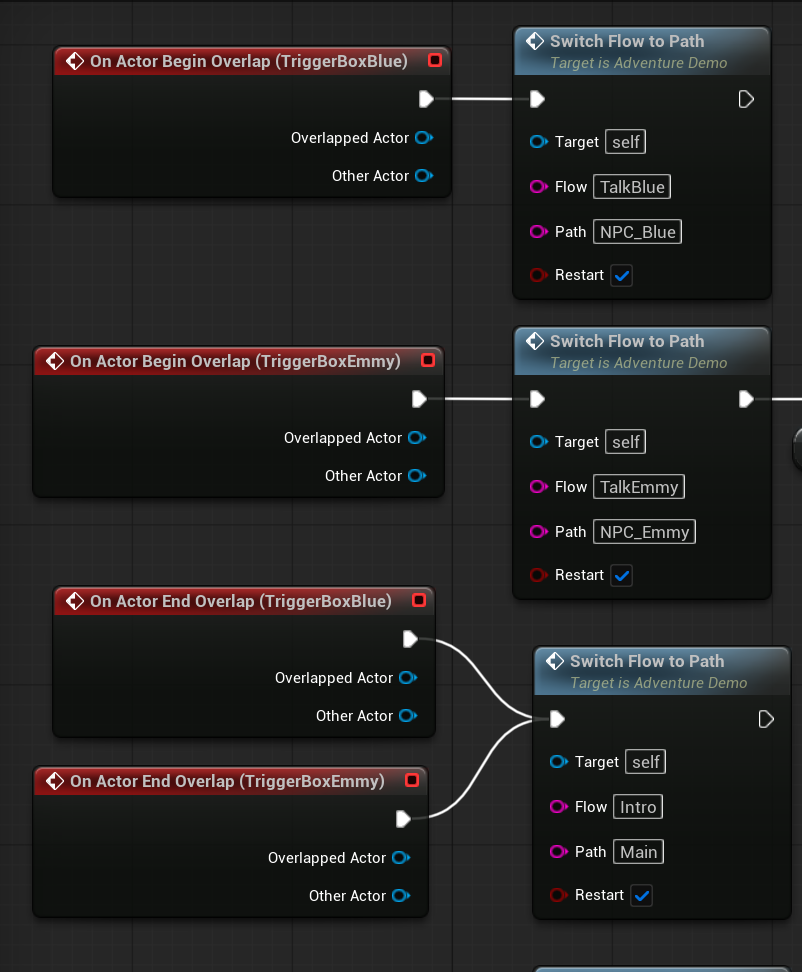
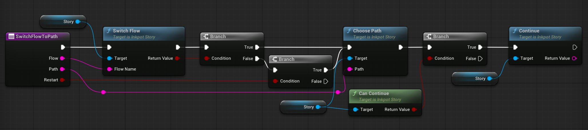
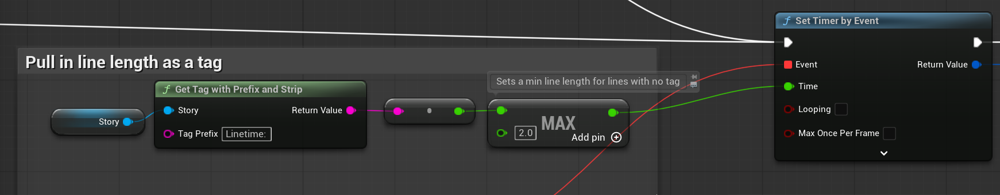
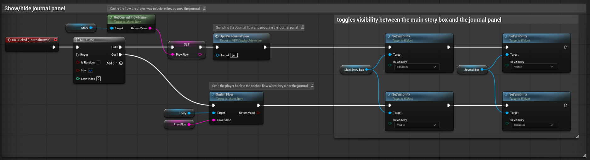
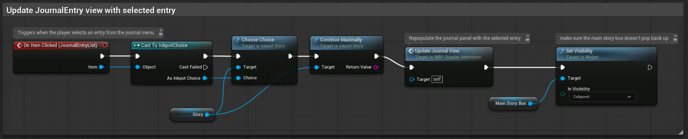
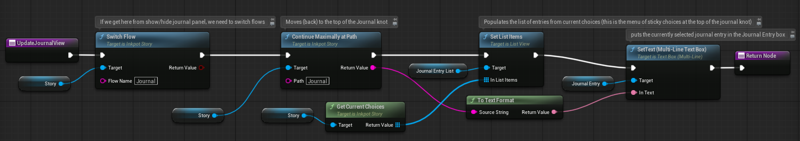

# Inkpot Adventure Demo

## Intro

The Adventure Demo provides design patterns and an example of how to use Ink and Inkpot to manage narrative text for a Narrative Adventure game in Unreal Engine.

It covers design patterns for implementing:
- Dialogue
- Player Journal
- Quests

### Audience

#### Journeyist Game Developers
You don't need to be an expert in either Ink or Unreal to follows this demo and documentation. But it is not a full walkthrough for every step of the Ink/Inkpot/Unreal toolchain.

This demo and documentation assume:

- You have a working knowledge of the [Ink narrative scripting language](http://github.com/inkle/ink)
- You know how to navigate Unreal Engine's interface
- You have basic familiarity with Unreal's Blueprints
- You've read the [Inkpot Demo Readme](README.md) and checked out the Demo level.

#### _Adventure_ Game Developers
This demo is focused on design patterns for games in which the player's place in the Ink story will be controlled by _Unreal_, not Ink. Typically, games in which the player can move themselves around the world and trigger narrative content by interacting with characters and objects they encounter.

Parts of these patterns may be useful for more traditional text adventures or visual novels, but when using Ink for a game like that, you can rely much more heavily on Ink's tools for managing the narrative flow.

### Non-Goals

The Adventure Demo is:

#### Not a definitive guide to Ink/Inkpot design patterns
This demo lays out _one_ way to use Ink and Inkpot to manage narrative text in Unreal, and serves as a practical guide for how to use Ink and Inkpot for game elements. It is far from the _only_ way.

#### Not a game framework
While you are free to copy, use, and modify the code included in the adventure demo, it's not a plug-and-play solution. It provides examples of useful design patterns that may help you learn your way around Inkpot.

In order to keep the focus on design patterns for narrative text using Ink and Inkpot, the Adventure Demo doesn't include a full suite of features you'll need to build a game.

The UI widgets also use pretty basic styling (which is a nice way of saying they're ugly).

## Before you proceed
Now's a great time to load the Adventure Demo level and play it if you haven't already. The rest of this guide will be referencing the Adventure Demo level and explaining how it works.

## Design philosophy
These design patterns were heavily influenced by Inkle Narrative Director Jon Ingold's GDC talk [Narrative Sorcery: Cohesive Storytelling in an Open World](https://www.youtube.com/watch?v=HZft_U4Fc-U). If you're interested in diving deeper on narrative design for open world games, it's well worth your time.

But for the purposes of this demo, the principles we're building on are as follows:

### Narrative text belongs in Ink
Ink exists to keep narrative design and game writing separate from other parts of the game development workflow.

Wherever possible, avoid spreading narrative text across systems. Ink's greatest advantage is that it can help you flexibly and gracefully change the narrative based on the player's game state--the more of the narrative you keep in Ink, the easier that is to manage.

### Narrative flow belongs in Unreal
If you look in AdventureDemo.ink, you'll see `-> DONE` diverts at the close of almost every knot and stitch. This makes the demo impossible to play through in Inky: there's no logic to control where the player is going next.

In a visual novel or a text adventure in Ink, we control where they player can go by using Ink code to determine when (and whether) to divert from one knot to the next. For example, if a surly guard in front of a locked gate refuses to let the player in until the player brings her some plot coupons, the player will not be given a choice to walk through the gate until the plot coupons have been duly presented.

By contrast, in a 3D game, the player doesn't need to wait for a narrative choice to go somewhere--they can just do it. If we don't want them walking past the guard, we have to _take the option away_ until conditions are met. Typically with a blocking volume, or the collision settings on the door's mesh.

Because of this difference, we're relying on logic in Unreal--not Ink--to determine which knots and stitches to present to the player. While a character's path through a knot or stitch is controlled in Ink, the knots themselves are separate addresses we use to pull the right content, rather than sections of a linear flow.

### You don't know where the player has been
The demo level opens by telling the player "go talk to the Silver pawn." But what happens if you go explore the other elements of the world instead?

When a well-designed game gives the player agency to move around and explore, it will respect that agency by gracefully handling cases where the player doesn't follow the signposts.

Knots (and stitches accessed directly from Inkpot; more on that below) should be written without assumptions about where players have been and what they've done before arriving. If a particular route is _possible_, it should be supported.

## Design Basics

### LISTs as state machines
Use of LISTs in Ink to track progress through the narrative are covered in [the Advanced State Tracking section of the Ink Docs](https://github.com/inkle/ink/blob/master/Documentation/WritingWithInk.md#part-5-advanced-state-tracking), and in Jon Ingold's [Narrative Sorcery GDC Talk](https://www.youtube.com/watch?v=HZft_U4Fc-U).

The short version:

The best way to avoid assumptions about the route a player has taken through the narrative is to track the state of storylines using LISTs. This is more elegant than relying on Ink's visit counts, as it allows the game to track states that a player can reach in different ways without a brittle and opaque tangle of queries.

(The even shorter version: `wolfquest ? KnowsOfWolf` is easier to maintain and read than `butcher.wolftalk || baker.wolftalk || candlestick_maker.sister_bit`).

If you take a look at `AdventureDemo.ink`, you'll see that Quest LISTs are being queried throughout--especially in `if` statements at the tops of knots and stitches. This is the only flow control happening within ink: Unreal directs the flow to the knot or stitch, and these `if` statements route to the appropriate section based on the player's LIST states.

>[!TIP]
>**Inkpot Concept: Setting Variables**
>
>For the most part, the various state LISTs in this demo are being handled within Ink: new states are added when particular lines of Ink are run, and states are queried to direct to the correct content in a knot or stitch. Handling Ink variables in Ink should be preferred where possible, because it's usually simpler to manage.
>
>But where needed, Ink variables can be edited directly from Unreal. The Adventure Demo level blueprint is using Inkpot nodes to directly change variables in Ink in two places.
>
>Our first directly-set variable is `clocktime`. The Ink runtime has no way to access the system clock, so while we use the variable in Ink, we can't set it there. We declare it in Ink as an empty string, then update it from the level BP to a string of the player's current system time whenever they speak to Emmy.
>
>We do this with a `set value` node:
>
>
>
>The second place we set variables directly is when the player overlaps the `Trigger Capsules` for the three shapes. `On Event Begin Overlap` nodes for these capsules are calling a custom `Add to list` function and adding each shape to the player's inventory (an Ink LIST) before switching to the FindShapes flow to show the player the appropriate quest text:
>
>
>
>Here's the `Add to List` function, which uses the Inkpot functions `Get List`, `To String Array`, and `Make Inkpot List from String Array` to pull the list from Ink and adds the indicated item:
>
>
>
>Once the player gets all three shapes, `QuestFindShapes.GotShapes` should be set to `true`. We could do this from Unreal by querying the Inventory LIST and checking if all three shapes are present--but since the blueprint always directs to `Quests.FindShapes_quest` after the player interacts with a shape, it's easier to set the state within Ink instead of doing additional round-trips to Unreal and back:
>
>```ink
>= FindShapes_quest
>
>{
>    - QuestFindShapes ? ToldBlue:
>        [...]
>   - InventoryItems ? (cone, cube, sphere):
>       ~ QuestFindShapes += GotShapes
>       [...]
>   - QuestFindShapes ? BlueAsked:
>       [...]
>}
>
>-> DONE
>```
>
>**In summary**: manage Ink variables within Ink wherever practical--but don't be afraid to use Inkpot when a variable needs to change based on interactions with the world (as in our shapes), or when Ink lacks the functionality to do what you need. 

### Interactions are knots and stitches

A player will typically encounter narrative text in the game by tripping some kind of trigger event, such as:
- `BeginPlay`,
- `BeginOverlap` with a trigger volume
- Hitting the key or button to pull up their journal
- walking up to a character or object and pressing the key or button indicated by the interaction prompt.

This design pattern connects each individual trigger event in the game world to a knot or stitch--typically via the `SwitchFlowToPath` function found the Demo Level BP:



When one of these events happens in the game, Unreal will use the knot or stitch to pull the correct content. The player's path through that section of the Ink file will be managed within Ink. In order to take full advantage of flow management, each trigger (or related group of triggers, such as picking up shapes) should have its own flow.

>[!TIP]
>**Inkpot Concept: Switch Flow, Switch Path, and Switch Flow To Path**
>
>[The Inkpot Demo Readme](README.md) documents how to use flows to run separate sections of the Ink file in parallel.
>
>Players can move back and forth between flows and Inkpot will save their place so they can pick up where they left off when they return.
>
>You can switch flows using the Inkpot `Switch Flow` node, and you can direct the current flow to a particular knot or stitch using `Choose Path`. But the Inkpot Demo level has a handy function that will do both at once, called `Switch Flow To Path`:
>
>
>
>`Switch Flow To Path` is a handy shortcut you'll probably want to add to your project--the Adventure Demo design patterns use it often.


#### Knot or Stitch?
In the demo, we are using both knots and stitches as interaction paths accessed directly from Unreal.

Interacting with the shapes directs the flow to the `Quests.Findshapes_quest` stitch to pull the appropriate quest text.

In contrast, overlapping Emmy or Blue's trigger volumes directs the flow to their respective knots.

Which option to use comes down to how complex the associated narrative text is.

For this demo, we are using knots for each NPC. NPC conversations can be complex, and even a simple demo like this includes multiple conversations with each NPC--so knots make more sense.

For quests and journal entries, we're using stitches within the `Quest` and `Journal` knots, respectively. Quest stitches use a simple if statement (again based on LIST states) to serve the correct line of quest text. Journal entries are longer, but fairly linear, and are easy to store in a stitch.

## Design Patterns

Here's a more in-depth guide to the design patterns for our three types of narrative text in the demo:

### Dialogue
The Dialogue pattern in this demo is using trigger volumes to initiate dialogue for each NPC, and each NPC has their own knot in the `AdventureDemo.ink`: `NPC_Emmy` and `NPC_Blue`.


The logic to update the UI with each line of dialogue and handle player choices lives in `WBP_Display_Adventure`, and is largely unchanged from the Inkpot Demo level.

>[!TIP]
>**Inkpot Concept: Switch Flow vs Switch Flow to Path**
>
>Flows allow Inkpot to keep track of multiple threads within the story--such as multiple NPC conversations--so that players can move between sections of the narrative without losing their place.
>
>In this example, however, we're using `Switch Flow To Path` for most of our flow switches, which always directs the flow to the top of the associated knot or stitch, rather than continuing where the player left off.
>
>Because the NPC knots contain multiple conversations, we want the flow to be directed back to the routing logic at the top of the knot to pick the appropriate conversation based on the player's LIST states. The same applies to pulling the correct quest text.
>
>But this demo doesn't lock player movement, so players can wander off in the middle of conversations--and when they come back, Ink will start the conversation again if the player's LIST states haven't changed.
>
>If you look at the `NPC_Emmy.intro` stitch, you'll see we're using the named line `EmmyGivesJournal` as a checkpoint so that Emmy doesn't introduce herself again if the player moves away after the intro.

>[!TIP]
>**Inkpot Concept: Reading from tags**
>
>Inkpot contains nodes to read tags from Ink and use them within Unreal Blueprints. We have an example of this in the `Linetime: ` tags in AdventureDemo.ink.
>
>Inkpot lines can differ in length, which means they take different amounts of time to read.
>
>To handle this, there's logic in `WBP_Display_Adventure` to pull in the `Linetime` tag from Ink (Using the `Get Tag with Prefix and Strip` function, which, when given the prefix `Linetime: `, turn `Linetime: 2.5` to `2.5`) and pass the value into the `Set Timer by Event` node that times how long to show each line.
>
>
>
>(The `max` node returns the _maximum_ of its two inputs, so the linetime will always be set to the longer of 2 seconds, or the time specified by the Line Tag. This default ensures that the line time won't be set to 0 if the tag is missing).

### Player Journal

In the Ink file, Journal entries each have their own stitch in the "Journal" knot, which contains the journal entries (stored in stitches) and the menu/table of contents (in a sticky choice block).

The logic is pretty simple:
- A list of journal entries serves as a state machine to control which entries the player can see.
- The `JournalBookmark` variable stores a divert target to the current active entry.
- A sticky choice block serves as the table of contents/menu for the journal.
- The `<-JournalBookmark` line pulls the text of the active journal entry into the main knot, where it will be pulled--along with the journal menu--into the Journal panel in Unreal Engine.

Adding a new Journal entry to the Ink file has three steps:

#### Add it to the list

Pick a descriptive name for your entry. For an entry about getting the time for Emmy, we'll call it EmmyTime. Add it to the `JournalEntries` LIST at the top of the Journal knot.

This list will be used to determine which entries a player has access to during the story. 

#### Create the entry

Create a stitch within the Journal knot.

For the EmmytTime entry, we'll name it EmmyTime_entry.

Note: you need to differentiate the stitch name from the list item or the Ink interpreter will throw an error. You can technically name it anything you want, but it's easiest to stay organized if you use the descriptive name from the list and pick a consistent format to make the stitch name different from the list item. This demo ends each stitch name in `_entry`.)

Add the text of your entry to this stitch, and end with a DONE divert.

**Formatting note**: For demo purposes, the function ToTextFormat in WBP_Display_Adventure has a hard-coded Replace node to turn `<br>` into an additional newline, to make these entries easier to read.

#### Add it to the journal menu

In the Journal knot itself, above the entry stitches, there's a block of Journal entry choices. This is the menu/table of contents.

Each journal entry should be added to the menu as a sticky choice within the choice block. The choice should be gated behind a condition that checks if the player has access to the entry, and the choice text should be a human-readable name for the entry.

Inside the choice, all you need to do is:

1. Set the `JournalBookmark` variable to a divert target to the stitch you created.
2. Divert back to the main Journal knot.

Like so:

```
+ {JournalEntries has EmmyTime} [Quest: Give Emmy the time]
    ~ JournalBookmark = -> EmmyTime_entry
    -> Journal
```

`JournalBookmark` sets the active Journal entry, which the Journal knot will thread in.

#### Unreal Logic

>[!TIP]
>**Inkpot Concept: Flows aren't simultaneous**
>
>[The Inkpot Demo Readme](README.md) notes that flows allow us to run threads of the story "run at the same time," but it's important to note that Inkpot does not currently allow players to be in two flows _simultaneously_. Instead, Inkpot saves the player's place in each flow, and when they return to that flow, they pick up where they left off.
>
>The Journal implementation takes advantage of this to manage what happens when the player closes the journal. When the player opens the Journal panel, they switch into the Journal flow. When they close it, they return to the flow they were in previously and pick up where they left off.

If you look at the Blueprint graph in `WBP_Display_Adventure`, you'll see the logic for the journal in two sections:

The "Show/hide journal panel" section handles the logic to switch between the journal panel (where this text is displayed) and the Main Story panel (where you'll see dialogue and quest text).



That way, a player can open their journal when there's other ink text showing for them to read--and when they close their journal, it'll drop them in their previous flow.

The "Update JournalEntry view with selected entry" section handles the logic for switching between journal entries when the player selects something from the list.



In addition to adding the selected entry text to the JournalEntry panel, the UpdateJournalView function populates the JournalEntryList panel with the entries the player can select:




>[!TIP]
>**Inkpot Concept: Story Change Delegate**
>
>When the player gets access to new journal entries, a notification will pop up in the UI.
>
>This is triggered within `WBP_Display_Adventure`, using a Story Change Delegate:
>
>
>
>This allows game logic in Unreal (in this case, the Widget Blueprint) to get notified when an Ink variable changes, and kicks off a custom event--which in turn displays the "Journal updated" widget for two seconds.


### Quests

#### Ink setup

Quests in this demo are making heavy use of LISTs as state machines to track the player's progress, as explained in [Design Basics](#design-basics)

We're again using flow-switching to know when to display quest text. Text for each quest is stored in its own stitch in the Quests knot. When `Switch Flow to Path` is called from Unreal to access the stitch, switching logic within the stitch will show the appropriate text depending on the player's progress.

It's worth noting that quests don't need player-facing text of the sort you'd see in a quest log: you can track states of various storylines and use that information to impact the course of the narrative without popping up notices and instructions to the player. This demo uses pretty traditional style game quests in which the player runs errands to advance the story. But in a mystery game, for example: you might want to track the clues a player has seen without calling attention to the fact that they're important.

#### Unreal setup

At the moment, there's no Unreal-specific setup to do for quest text--it will be handled by the same Blueprint logic being used for dialogue.

That's because there's no dedicated UI surface for Quest Text in this demo. Since it's not possible for the game to be in two flows at the same time, we can't display quest text and dialogue simultaneously--so they share a UI panel.

(The journal also can't be displayed simultaneously, but since the Journal UI panel hides the main story panel, switching the flow to the journal and back is seamless for the player. It wouldn't make sense to interrupt dialogue to show quest updates).

The upshot is that you'll need to think about when to trigger quest text to make sure it's not interrupting other narrative text.

In the demo, we're triggering quest text when the player interacts with the shapes, and when the player leaves an NPC trigger volume and returns to the default flow. This makes sure it won't collide with dialogue.