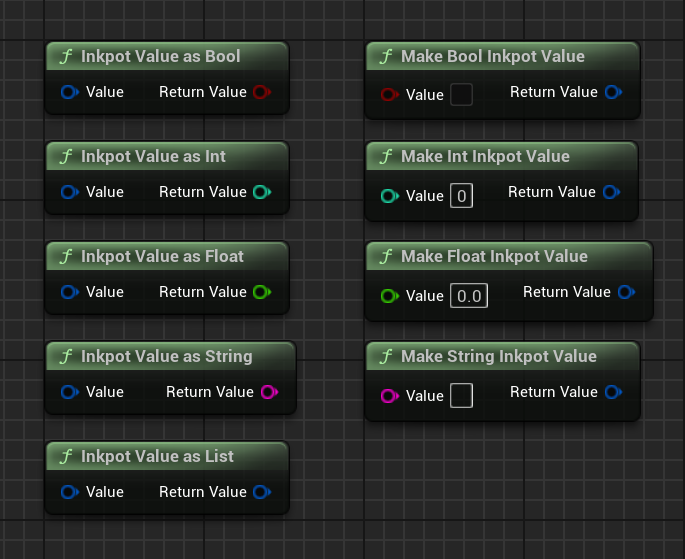
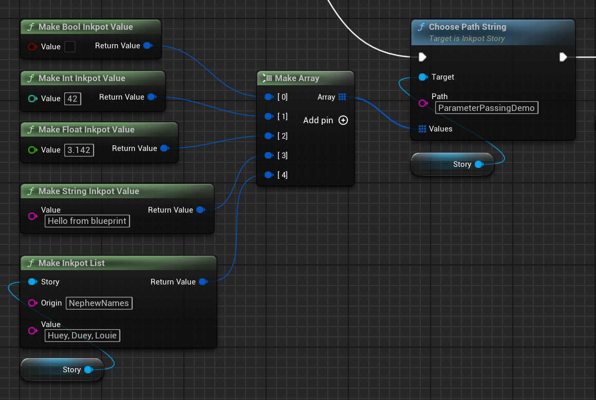
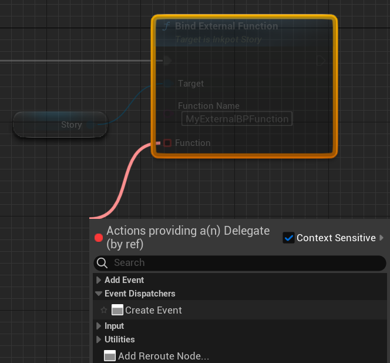

# Inkpot Demo
Small demo project in Unreal showing how to use the Inkpot plugin for Unreal Engine created by [The Chinese Room](https://www.thechineseroom.co.uk/).  
Inkpot is a wrapper for the scripting language **Ink** developed by [Inkle Studios](https://www.inklestudios.com/ink/) 
See the [Inkpot github](https://github.com/The-Chinese-Room/Inkpot) for more info on the Inkpot plugin itself.  
This project works with Unreal Engine version 5.4 or later. 

## Folder structure 

	Content
		InkpotDemo
			Framework 
				BP_InkpotDemoGameMode 
					- game mode Blueprint, creates UI, handles Inkpot OnStoryBegin.
			Maps
				Demo 		
					- A demo of Ink scripts interacting with level blueprints and actors. 
				HelloInk	
					- The most minimal demo using the default ink story.
				Intro 		
					- An intro screen for those that don't read docs.
			Props
				BP_InkyCube	
					- actor blueprint showing how to get Ink variable change notification. 
			Stories			
				- all the Inkpot story assets.
			UI
				WBP_Display
					- the main display widget, this is where most of the Ink logic lies.
				WBP_Choice
					- widget for choices that can be made in a story, used by WBP_Display.

## Editing Ink source
Use Inky, which you can get from here. 
https://github.com/inkle/inky

## Importing ink files 
To import, drag the ink source file into a content browser window within the Unreal Editor. 
The will create the InkpotStoryAsset, that contains the compiled JSON from source. 

### Note: .net 5.0 requirement
If your Ink file fails to import, then you most likely do not have **.net 5.0** installed. 
Inkpot compiles your source when you import using the InkleCate compiler, & InkleCate requires the **.net 5.0** framework. 
To fix install the **.net 5.0** framework  
https://dotnet.microsoft.com/en-us/download/dotnet/thank-you/runtime-5.0.17-windows-x64-installer 

## Setting up auto reimport
Open editor, preferences.  
Look Under general, loading and saving, auto reimport. 
Add a new 'Directories to Monitor' entry by clicking the plus. 

Include the source folder, map directory to the corresponding folder in the unreal content browser.

Once this is setup, the content directory will automatically update when you update, create or delete any ink files in the source folder.

## Starting a story 
In blueprints, get the Inkpot subsystem and call BeginStory, passing in the InpotStoryAsset. 

This returns the runtime InkpotStory that executes the script.  
In this demo, the stories are started by the Level Blueprint.

## Getting story updates
Once the story has been started using the BeginStory function of Inkpot, it will return an InkpotStory. 
The InkpotStory is the runtime for the Ink script execution. 
In this demo, the UI is hooked up to the InkpotStory created by the level blueprint. 
This is done in the game mode blueprint, BP_InkpotDemoGameMode. 

The UI, where all of the story updates happen, is defined by the widget WBP_Display. 
The event graph looks like this.  

Here we see the events that drive Ink execution. 

### OnContinue 
This is called once the story has continued. Here we update the UI to show the current story's text, and update the choices if there are any.  
This event happens in response to Continue being called on the story. 

### OnMakeChoice
A choice has been made. In this demo the user has clicked on a choice shown ( see OnItemClicked ), and the ChooseChoice function has been called.  
Here, we continue the story, which will result in OnContinue being called thereby updating the UI.  

### OnSwitchFlow
Flows allow several 'threads' of story to run at the same time. This is used in the demo level to give contextual story snippets fopr wherever the player has walked to. 
This event is called in response to calling the function SwitchFlow on the InkpotStory object. 

## Variables
Ink supports type free variables, Blueprints require typed variables.  
To allow conversion between the two there is a blueprint function library to convert from one to the other. 

	/* Create an Ink Value from a boolean */
	FInkpotValue MakeBoolInkpotValue(bool bValue);

	/* Cast Ink value to a boolean */
	bool InkpotValueAsBool(FInkpotValue Value);

	/* Create an Ink Value from an integer */
	FInkpotValue MakeIntInkpotValue(int32 Value);

	/* Cast Ink value to an integer*/
	int32 InkpotValueAsInt(FInkpotValue Value);

	/* Create an Ink Value from a float */
	FInkpotValue MakeFloatInkpotValue(float Value);

	/* Cast Ink value to a float*/
	float InkpotValueAsFloat(FInkpotValue Value);

	/* Create an Ink Value from a string */
	FInkpotValue MakeStringInkpotValue(const FString &Value);

	/* Cast Ink value to a string*/
	FString InkpotValueAsString(FInkpotValue Value);

	/* Create an Ink List from an array of Strings */
	FInkpotValue MakeInkpotList(const TArray<FString> &Value);

	/* Get an array of strings from an Ink List */
	TArray<FString> InkpotValueAsList(FInkpotValue Value);    

Alternatively, values can be set directly through the InkpotStory object using one of the Set or Get functions. 
These functions also report whether the variable exists in the script via the return parameter *Success*. 

	void SetBool(const FString &Variable, bool bValue, bool &Success );
	void GetBool(const FString &Variable, bool &ReturnValue, bool &Success );

	void SetInt(const FString &Variable, int32 Value, bool &Success );
	void GetInt(const FString &Variable, int32 &ReturnValue, bool &Success );

	void SetFloat( const FString& Variable, float Value, bool &Success );
	void GetFloat( const FString& Variable, float &ReturnValue, bool &Success );

	void SetString( const FString& Variable, const FString& Value, bool &Success );
	void GetString( const FString& Variable, FString &ReturnValue, bool &Success );

	void SetEmpty( const FString& Variable );

To check if a variable simply exists, call this function. 

	bool IsVariableDefined( const FString& Variable );

### Change notification
There are a couple of ways of getting change notification from Inkpot, *Story Change Delegate* and *Inkpot Watch Component*.

#### Story Change Delegate
Variable change notification can be achieved through binding to the set on variable change delegate of the story.

#### InkPotWatch component
The InkPotWatch component allows Actors to receive the notification of variable change.
Open up the Actor blueprint and Click Add component, choose InkpotWatch.

Rename it to represent its purpose

Then hook up the event, 

And when this blueprint is placed in the world, set the 'Variable Watch' field to the name of the ink variable to be watched.

## External Functions
As of version 0.2.20 of Inkpot, you can bind external C++ and Blueprint functions to Ink, so that they can be called directly from the Ink script. 

### Hooking up to Blueprints
Here are the steps you need to follow to bind a _Blueprint_ function to Ink. 
First, in your ink script define the external function as you normally would. 
( don't forget to reimport your Ink files )  

	EXTERNAL MyExternalBPFunction( ABoolean, TheAnswer, PI, Message, AreasVisited )

Use the _Bind External Function_ node, to declare the binding to your story, like so 

_Function Name_ is what we called the function when we declared it in the ink script, this should match. 

_Function_ should link to a Blueprint function matching the general signature of _FInkpotValue MyFunction( const TArray\<FInkpotValue\> &Values )_ 

The easiest way of doing this is as follows: 

1. Drag off the Function pin, then select _Create Event_ under _Event Dispatchers_ 

2. Then from the new _Create Event_ node, select _Create a matching function_. 

3. All going well, you will be presented with your shiny new Blueprint function. 
Which here simply prints the first parameter (a string). 

### Parameter Passing
Parameters from Ink are passed into the external function as an array of Inkpot values. 
The parameters are ordered in the array with the left most function argument being the first at index 0 of the array, the second argument will be at index 1 and so on. 

As values in Ink are not typed, you'll need to use helper functions to convert from Inkpot Values to the typed values that Blueprints use. 
To make things easier, here are some helper functions to convert the elements of the Inkpot Value arrays. 

See the demo for a more complete example. 
 
## Debug Log
Inkpot has it's own debug category, which you can filter the OutputLog by.
This can be turned off by settings and CVars.

## Settings and CVars
As of 0.4.20 Inkpot has settings to control its operation.
These can be found in the Plugins->Inkpot section of Project Settings.

### Debug Log 
Turns debug log on or off.  
CVar Inkpot.DebugLog 
Default is true. 

### Reload If Asset Changed
For runtime, reloads and restarts the story if the asset has been reimported ( mainly with auto-reimport on ).  
Allows for quick edits of ink whilst running the game.  
CVar Inkpot.ReloadIfAssetChanged 
Default is false. 

### Replay If Reloaded
For runtime, if the story has been reloaded, if this option is set, Inkpot will replay all choices, path & flow changes made to the current point. 
Allows for quick edits of ink scripts whilst running the game, 'live edit'.  
CVar Inkpot.ReplayIfReloaded 
Default is false. 

---

# Testing InkPlusPlus
We have 180 active tests in Inkpot that test the implementaion of the InkPlusPlus module. 
These can all be run through the *Session Frontend* within the Unreal editor. 
To run the tests, first open the *Session Frontend* from Tools, Session Frontend. 

Select the automation panel, and click the check box next to **Inkpot**. 
Then hit the play button to start the tests. 

